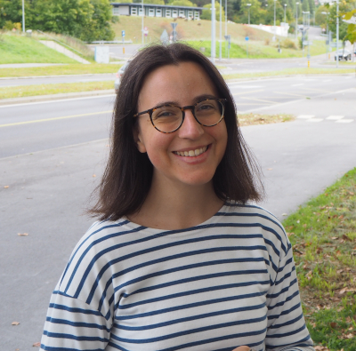

::: {.grid}

::: {.g-col-12 .g-col-md-6}

:::

::: {.g-col-12 .g-col-md-6}

Bienvenue! Je suis chercheuse postdoctorale à l'[université de Padoue](https://www.stat.unipd.it/en/).
Ma recherche porte sur l'analyse de valeurs extrêmes, plus particulièrement sur les modèles dynamiques pour séries chronologiques et de régression, ainsi que l'estimation de densité prédictive dans le paradigme bayésien. Mes intérêts appliqués sont en lien avec les applications environnementales et financières.

:::

:::

De l’automne 2024 à l’été 2026, j’ai été chercheuse postdoctorale à l'[université Bocconi de Milan](https://dec.unibocconi.eu/) où je travaillais avec [Simone Padoan](https://faculty.unibocconi.it/simonepadoan/).
J'ai obtenu un doctorat en statistique de l'[Université de Bologne](https://stat.unibo.it/en/index.html) en avril 2025 sous la direction de [Luca Trapin](https://sites.google.com/site/lucatrapin/home). Durant ma thèse, j'ai aussi effectué une visite d'un an à HEC Montréal où j'ai travaillé avec [Debbie Dupuis](https://www.hec.ca/profs/debbie.dupuis.html).

### Publications

::: {#refs}
:::
